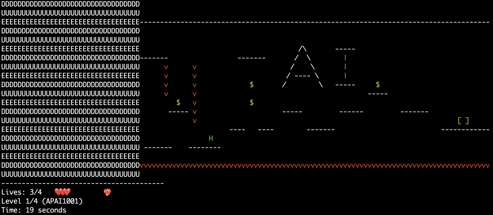

# **DDL Fighter**

> **DDL Fighter** is a fun and challenging terminal game designed to simulate the experience of racing against deadlines. Players traverse upto six unique levels, representing different courses, while managing their health and time effectively. The game features random events triggered by player actions that make each playthrough unpredictable and engaging. Players receive scores at the end of each level and a final GPA upon completing the game, reflecting their performance.

---
# **Demo**
[](https://www.youtube.com/watch?v=i3o0LayMPoA)

---
# **Team Members (Group 220)**

| **Name**            | **Contributions**                                          |
|----------------------|-----------------------------------------------------------|
| Cheung Chuen Pui    | UI design.                                                |
| Feng Xuefei         | Incidents UI, Random events ,Score system.                                  |
| Lu Bitong           | Health system, Random events, Makefile, Main logic.           |
| Shao Shenghe        | Map UI design (apai1001, caes1000, comp1117, stat1016).   |
| Tan Jiaqi           | User control system, File In/Out, Debug.                 |
| Xu Tianjian         | Map Logic, Map UI design (stat2601, math2014).           |


---

## **Features**

- **Data Structure:** Including 2D Vector to store and display all the maps, basic data types e.g. int, char, string.
- **Random Events:** (Incident directory) Trigger random events like adding or reducing time, increasing or decreasing health, pausing the DUE, and more, to make the game more dynamic and challenging.
- **Dynamic memory management:** (in main.cpp) Record random event, score and GPA while gaming.
- **File input/output:** (in score_system.cpp) Store player's record in **record.txt** at the end of the game, read from the **record.txt** and display in the terminal to show player's gaming records.
- **Multiple files:** (All_maps & Incidents directory) The former contains all the map UI and logic code files and the latter contains all the random events' logic code files.

---

## **How to Play**

1. **Start the Game:**
   - Launch the game and choose your difficulty level (**Easy**, **Medium**, or **Hard**).
   - The game starts at Level 1, with each level featuring unique maps and events.

2. **Controls:**
   - Use the following keys to control your character:
     - **`A`**: Move left
     - **`D`**: Move right
     - **`W`**: Jump
     - **`Q`**: Quit the game
     - Important: In order to jump, you must hit **`W`** first, then hit **`A`** fast to jump leftwards (hit **`D`** fast to jump rightwards).
3. **Objective:**
   - Traverse the map, avoid traps, collect random event items (`$`), and reach the endpoint (`[ ]`) to proceed to the next level.

4. **Random Events:**
   - When the player touches a `$`, a random event will be triggered. These events include:
     - Adding time
     - Reducing time
     - Pausing the DUE
     - Reversing the DUE
     - Increasing or decreasing health

5. **Completion and Scoring:**
   - At the end of each level, scores are calculated based on time, health, and performance.
   - Upon completing all levels, view your final GPA and scores.

---

## **Non-Standard Libraries**

1. **<termios.h> (Terminal Control Library)**
   - **In `user_control.h/cpp`:**
     - Used for real-time keyboard input detection, allowing key presses to be detected without pressing Enter.
     - Enables raw input mode by modifying terminal attributes.
   - **In `ui.h`:**
     - Used to set terminal display modes.
     - Controls terminal input and output behavior.

2. **<unistd.h> (UNIX Standard Library)**
   - **In `ui.h`:**
     - `usleep()` is used for delays in animations and loading effects.
     - `read()` is used to read user inputs.
     - `STDIN_FILENO` is used for standard input operations.
   - **In `main.cpp`:**
     - Used to implement frame rate delays during gameplay.

3. **<sys/select.h>**
   - **In `user_control.cpp`:**
     - Used for non-blocking user input detection.
     - Allows the game to process other logic while waiting for user inputs.

---

## **Compilation and Execution**

### **Environment**

- **Operating System:** Linux/macOS/Windows
- **Compiler:** Any C++ compiler that supports C++11 or higher (e.g., `g++`, `clang++`)
- **Dependencies:** None (fully implemented using standard libraries)

### **Steps to Compile**

1. Open a terminal and navigate to the project's root directory:
   ```bash
   cd /path/to/project
2. Compile the game using the make command:
   ```bash
   make
3. If you don't have make, manually compile the game with the following command:
   ```bash
   g++ -std=c++11 -Wall -Wextra main.cpp ui.cpp DUE.cpp user_control.cpp health_system.cpp score_system.cpp \
    All_maps/map1001.cpp All_maps/map1117.cpp All_maps/map1000.cpp All_maps/map1016.cpp All_maps/map2014.cpp \
    All_maps/map2601.cpp All_maps/map_utils.cpp Incidents/incidents.cpp Incidents/reduce_health.cpp \
    Incidents/add_health.cpp Incidents/pause_DUE.cpp Incidents/add_time.cpp Incidents/reverse_DUE.cpp \
    Incidents/reduce_time.cpp -o game
4. Run the game:
   ```bash
   ./game

---

# **Project Structure**
Here is the directory structure of the project files:

  ```powershell
    .
    ├── main.cpp                # Main entry point of the game
    ├── ui.cpp / ui.h           # Terminal UI controls
    ├── DUE.cpp / DUE.h         # Logic for the DUE(deadline) behavior
    ├── user_control.cpp/h      # Player control logic
    ├── health_system.cpp/h     # Health system
    ├── score_system.cpp/h      # Scoring system
    ├── All_maps/               # All level map implementations
    │   ├── map1001.cpp
    │   ├── map1117.cpp
    │   ├── map1000.cpp
    │   ├── map1016.cpp
    │   ├── map2014.cpp
    │   ├── map2601.cpp
    │   ├── map_utils.cpp
    ├── Incidents/              # Random event logic
    │   ├── incidents.cpp/h
    │   ├── add_health.cpp/h
    │   ├── reduce_health.cpp/h
    │   ├── add_time.cpp/h
    │   ├── reduce_time.cpp/h
    │   ├── pause_DUE.cpp/h
    │   ├── reverse_DUE.cpp/h
    └── Makefile                # Build script
```
---

# **Screen Shot**
Here is an example of the in-game display:



---

# **Happy Gaming!**
